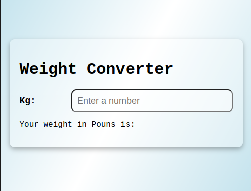

# Weight Converter   

## Converter Kg to pounds

    <a href="#author"> 🔎	About the Author</a>

<h4 align="center">
Project status: ✅Done
</h4>

### 📝 Features

- [x] Convert weight from kg to pounds

### 🧐 Demonstration

<h1 align=center>

</h1>

## 👩🏻‍💻 How to test this application

### ✅Prerequisites

- [x] Computer with a Browser installed
- [x] Free time to test

### 👨🏻‍💻 Testing the web application

- Clone this repository and save in your desktop directory
- Double click on index.html
- Type your weight in kg and see in pounds
- After 10 seconds it will reset

## 🌐 Used Tecnologies

- [HTML5](https://developer.mozilla.org/en-US/docs/Web/HTML)
- [CSS3](https://www.w3.org/Style/CSS/Overview.en.html)
- [Javascript](https://developer.mozilla.org/en-US/docs/Web/JavaScript)

### 🙋‍♂️ Author
---

<a href="https://www.linkedin.com/in/edercirino/">

 

<b>Éder Cirino</b></a>

Made with ❤️ for Éder Cirino 👋 Get in touch

 
